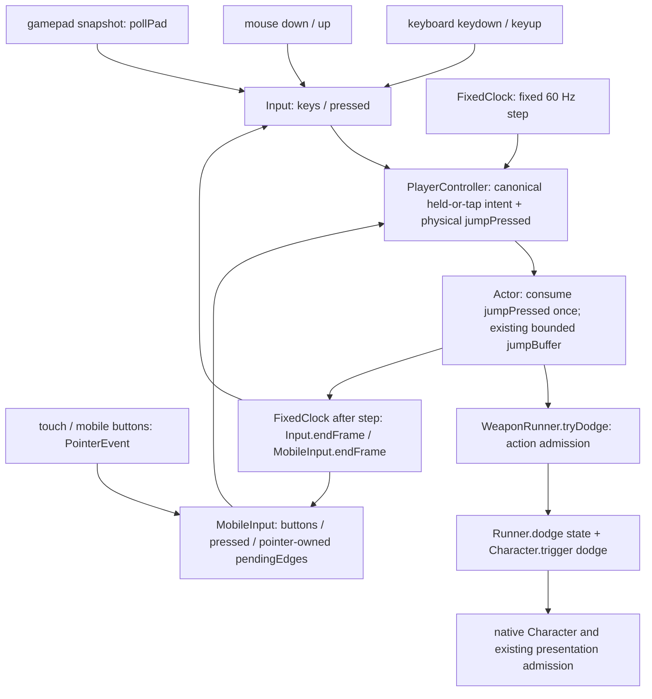

# INKWAVE Gameplay Input / Action Reliability

## Baseline と作業範囲

- Baseline main: `5e28dbd16f7829aebd88052ff5f7fdf71f39fdad` (`rhgrive3/actions`)。
- 専用branch: `inkwave/action-reliability`。
- 実装commit: `9ff790a34bc4e0d488c7a50d3c92305069bd8a3e`、終了境界修正 `91093a8fe0046c0d0a26420176fde18ae8426d53`、browser trial位相固定 `d29c80b9fd61f27439b168f135bc66ddad01fa91`。
- Worktree: `/mnt/workspace/.dev-state/agent-work/checkouts/inkwave-action-reliability/worktree`。
- 永続evidence: `/mnt/workspace/.dev-state/agent-work/evidence/inkwave-action-reliability/`。
- 対象は公開版 `inkwave-public/` のbuild-only adapter。別の試作版 `game/` は対象外。
- upstream、profile、movement runtime、pose、gyro/PWA/lifecycle、network packetは変更していない。mainへのpush/merge、PR、Pages変更はしていない。

## Root cause

1. **物理pressをActorでheldから再生成していた。** 既存clockは短いkeyboard/touch/gamepad jump edgeを次のfixed tickまで保持していた。しかしPlayerControllerはpressとheldを `intent.jump` に合成し、Actorは再び `intent.jump && !prev.jump` を計算した。jumpを保持した1回目のdodge後、tick間でrelease→pressすると、前回のsimulationのheldがtrueのままなので2回目の物理pressがfalseになる。入力のreleaseがsimulationに見えた位相だけ成功する。
2. **gamepadのjump以外のpending edgeがcanonical intentへ接続されていなかった。** `padPressed` は保持されても、fire/sub/squid/specialはpoll時点のheldだけを読んでいた。render-only frameで観測した短いfireとjumpを次のtickまでに離すと、jumpだけ届き、fireがないためDualiesのdodge受付で拒否される。triggerのedge判定はhardware `pressed`、heldは `value > 0.3` で閾値も違っていた。
3. **subの当tickのintentと前tickのrunner状態が不一致。** dodgeはRunner.updateより先に受付するため、新しいsub holdとjumpが同時に来ても古い `aimingSub=false` だけを見てrollを開始できた。
4. **pointer lock喪失でmouseのpending pressが残っていた。** heldはfalseになるがleftPressed/rightPressedとlook displacementが残り、次tickで入力を再生できた。

5. **終了済みのdodge timerが浮動小数点誤差で1tick残る。** 0.2秒のrollに1/60秒を12回加算すると `0.19999999999999998` となり、厳密な `>= 0.2` がfalseになる。終了後の次pressがactive dodgeとして拒否される。比較に `Number.EPSILON * Math.max(1, d.dur)` の丸め単位だけを許容し、既存durationの数学的境界で終了する。設定値・velocity・移動runtimeは変更しない。1tick前はactiveのまま、終了時はclear、次tickの合法pressは1回開始する回帰テストを追加した。

本家との比較対象はrepoに固定された11.3.0/Dualiesの通常入力条件である。ただしNintendo実機の受付フレーム・ギア別挙動は本タスクで測定しておらず、本家の数値一致は主張しない。

## Input ownership図

- Raw edgeのproducerは既存Input/MobileInputだけ。canonical `jumpPressed` は既存edgeの転送であり、第二のedge生成器・追加queue・時間bufferではない。
- Local Actorはphysical edgeを読み、そのtickでfalseに消費する。bot/remoteのintentにはこのfieldを追加せず、既存のheld差分fallbackを維持する。network serialisationは変更しない。
- keyboardのキーrepeatはedgeを作らない。gamepadはrenderごとに1回pollし、padPrevとの差を生成する。6/7のtrigger edgeにはcanonical heldと同じ `value > 0.3` を使う。hardware snapshotを変更しない。
- gamepad menu channelの既存ownership/hold maskは維持する。fixed clockはrender-only frameで得たgameplay edgeを保持し、tick後にclearする。
- touchのcompleted pointerupはtap edgeを残す。未消費のpointercancel/lostpointercaptureは当該pointerのedgeを取り消す。別pointerのcompleted tapは取り消さない。
- 120Hzなどtickのないrenderではedgeを消費しない。30Hz/frame dropのcatch-upでは最初のstepだけでedgeを消費し、後続stepはheld/releaseを読む。look displacementも既存clockが1回だけ消費する。
- 当tickで入力が禁止されているcontrollerはjumpPressedもfalseにする。既存blur resetと今回のmouse pointer-loss resetでpending inputを捨てる。PWA復帰処理は変更しない。

## Dodgeの合法条件とpriority

Dodgeは専用の別ボタンではなく、**Dualiesのjump press + 有効な移動方向 + fire intentまたは既存firing grace**である。Actorの既存jumpBufferから、kidかつgroundedでtryDodgeを呼ぶ。

受付priorityは次のとおり。

1. death、Super Jump、active special、新たに開始可能なspecialは既存のbody ownerが優先。
2. squid/airborne、active dodge、現在または既存のsub aim、移動量 `< 0.3`、roll予算0、rollInk未満ではdodgeを開始しない。
3. **sub holdと新しいdodgeが同tickならsubが優先。** 既にsub aim中のrelease tickも既存のthrowが優先する。この順序を回避するbufferは追加しない。
4. 合法なfire+jumpはdodgeが通常jump/shotより先に受付される。rollのinkを先に支払い、jumpBufferを消費し、roll中はshotを発射しない。inkがrollInkちょうどでも1回開始できる。
5. shot cooldownはdodgeの受付条件ではない。roll終了後のlock中も、roll予算が残れば新しい合法pressでchainできる。
6. groundedはintegrate前のsimulation状態を読む。landing直前の入力には既存の有限jumpBufferが使われ、接地後の次tickで受付される。既存deadlineを伸ばしていない。coyote/通常jumpの既存選択も変更していない。

CharacterのT_DODGEはnative event/pose clockであり、gameplay tryDodgeの拒否条件ではない。`runtime/action-admission.mjs` はpresentation arbitrationであり、本修正はそれを新しいgameplay受付ownerにしない。

## 14仮説の反証・確認

| 仮説 | 結果 |
|---|---|
| pressedがrender内で消える | keyboard/touch/jumpの既存clock保持は正常。mouse unlockのpending残留は確認・修正。 |
| fixed simulationがそのframeを見ない | render-only frameは存在するが保持は正常。Actorのedge再生成がその後で消す。 |
| pollでstate上書き | padPressedはclockで保持。canonicalがheldだけを読むgamepad actionの欠落を確認・修正。 |
| fireがdodgeを消費 | 逆。dodge受付はRunner.updateより先。短いgamepad fireが届かないとfire条件を満たせない。 |
| groundedが1tick遅い | integrate前の判定。既存bufferによるlanding次tick受付を検証。物理判定は変更しない。 |
| cooldown境界 | -epsilon/0/+epsilon/half-step/step/.5を検証。shot cooldownはdodgeを拒否しない。 |
| ink消費順序 | rollInkちょうどで開始、直下で拒否、同tickのshotよりrollが先。 |
| admission競合 | 現在sub intentの確認がなかった。同時subにpriorityを与えた。specialの既存priorityは維持。 |
| 古いdodge timer | Runnerの累積丸め誤差による1tick残留を確認・修正。Character/presentationのtimerには変更なし。 |
| mobileだけ別state | device-owned stateは別だがPlayerControllerのcanonical経路は同じ。別のdodge stateは追加しない。 |
| touchend/cancel差 | pointerup保持、cancel/lostcapture取消、別pointerのcompleted tap保持を検証。 |
| 同tickで2回poll | production mainの旧blockはadapterでclockへ置換され、通常pollはrenderごとに1回。render-only二重pollでも保持/非重複を検証。 |
| stale input | 既存blur取消とmouse unlock取消を検証。PWA/backgroundのruntime復帰はAstra #4の担当。 |
| buffer/tick ownership | Raw edge producer → canonical転送 → Actor一度消費 → fixed clock raw clear。新bufferなし。 |

## サブエージェント

- `./cline-5`（DeepSeek V4.1 Flash/xhigh）: input producer、poll、clear、build adapter連結を調査。17件の実コードprobeでrenderあたり1 poll、render-only時clear 0、tickごとclear 1、tap/hold/release/cancel/blur/device switch/reconnectを確認。親が17 recordsと21 source hashesを検証した。hash snapshotのtimestamp行だけは異なり、source hashは全て同一。比較controlは全reliability adapterを外した診断用であり、baseline成功率の分母には使わない。
- `./cline-6`（DeepSeek V4.1 Flash/xhigh → Muse Spark 1.3 Contributor/xhigh）: Actor/Runnerの合法条件、jumpBuffer、sub release、move threshold、Character gateを調査。DeepSeek枠終了とmodel切替の停止後に永続handoffから再開。最初のprobeはpatch import resolver不足で親検証に失敗し、その結果を証拠には採用していない。最終独立reviewは物理jump edge、bot/remote fallback、sub priority、trigger閾値とpointer resetを承認。追加のroll終了比較も独立レビューで承認した。このlaneは新suiteを実行しておらず、親のtest結果と独立実行を区別する。
- `./freebuff-5`: 指定どおり引数なしで起動したがaccount suspended。別番号は使わず、担当再現ケースを親が実装した。
- `./freebuff-6`（MiMo 2.6 Flash）: current/baseline両adapter chainに対する独立8,016件sweepを作成。phase、release gap、30/60/120/144Hz、irregular/.2s hitch、hold、blur、pointercancel/lostcapture、completed tap後のcancel、pad fire単独/同時dodgeを測定。親がharnessとJSONの分母・実動作カウンタ・adapter hashを確認した。

## Before / after成功率

| 実コードテスト集合 | Baseline | 修正後 |
|---|---:|---:|
| 親のtiming sweep: 3 device × 5 cadence × previous-held有無 × 400 phase | 6,000 / 12,000 (50%) | 12,000 / 12,000 (100%) |
| 独立sweep: 合法2回目dodge、gamepad fire、hold/cancelを含む | 6,321 / 8,016 (78.8548%) | 8,016 / 8,016 (100%) |
| 独立2回目dodge: keyboard/gamepad/touch 各 | 各1,035 / 1,152 | 各1,152 / 1,152 |
| 独立short gamepad fire/combo | 0 / 1,344 | 1,344 / 1,344 |

修正後の両sweepでduplicate/hold retrigger/cancel violation/setup failureは0。上記は定義したfixture集合での成功率であり、実ユーザーの障害発生頻度の推定ではない。親12,000件のprevious-held条件は既知のActor preconditionをセットし、別のregressionと独立sweepは実際の初回press→hold→release→repressで確認している。

## 変更ファイル

- `patches/reliability/input-adapter.mjs`: gamepad trigger edge閾値、pointer-loss mouse取消。
- `patches/reliability/touch-edge-adapter.mjs`: canonical jumpPressed転送と一度消費、gamepad action edge接続、current sub受付priority、丸め誤差によるstale rollの除去。
- `patches/reliability/tests/action-fixture.mjs`: complete build chain + actual Input/Player/Actor/Runner fixture。
- `patches/reliability/tests/action-reliability.test.mjs`: 16 regression（3 device、左右chain、tap/hold/release、cancel、priority、ink/cooldown、landing）。
- `patches/reliability/tests/timing-fuzz.mjs` / `.test.mjs`: 12,000件の実コードphase/cadence regression。
- `patches/reliability/tests/touch-edges.test.mjs`: Actor/WeaponRunnerのexact-anchor failure regressionを追加。
- `patches/splatoon3/tests/source-fixture.mjs`: test-only source adapter注入。既存呼び出しのdefaultは同一。
- `scripts/check-inkwave-browser.mjs`: フルmatchのnative keyboard→Actor→Character確認。
- `scripts/check-inkwave-reliability.mjs`: Chromium/WebKitのnative tap・DOM pointer re-press→実Actor/Runner/Character確認。
- 本reportと既存behavior comparisonへの参照。

## Test結果・identity

- Baselineの追加11 regressionは5 pass/6 fail。修正直後のfocused 38 testは38 pass（12,000-case fuzz含む）。追加後のaction regressionは16/16 pass。終了境界追加後のaction/touch既存testは35/35 pass、12,000-case fuzzと独立8,016-case sweepも再実行して100%。
- 親fuzz結果: `baseline-fuzz.json`, `after-fuzz.json`。
- 独立fuzz: `freebuff-6/results.json`, `phase-sweep.mjs`, `run-phase-sweep.mjs`。
- 初回実装SHA `9ff790a` のBuild成功。contentHash: `32d265750397ac745b775997159007f30e55ecbce5807cf6ab382a95e7ecfcb1`。既存exact-source lock、unique anchor、reliabilityIdentity、artifact identityを維持。
- Chromium/WebKit built-module/browser: 2 engines/26 checks pass。native tapとDOM touch release/repressが実Characterのdodgeに1回ずつ届く。ground collision/paint/projectile表示はfixtureであり、物理実機の証拠ではない。
- ローカルfull-game Chromium: shader warmupが180秒でtimeout、入力trialまで未到達。これをpassing evidenceとはしていない。
- 全既存gameplay/input suite + exact-source browser gate: [Actions run 37137787908](https://github.com/rhgrive3/actions/actions/runs/37137787908)、target source `9ff790a34bc4e0d488c7a50d3c92305069bd8a3e`。validate/UI/catalogは成功、active browserは失敗。次のrunで原因を特定した（下記）。

- [診断run 37139537621](https://github.com/rhgrive3/actions/actions/runs/37139537621)、source `91093a8fe0046c0d0a26420176fde18ae8426d53`: canonical patch/input/gameplay 759/759、local quality 8/8、motion/workflow verifier 10/10、reference/build成功。active browserの失敗は、live matchから残ったclock accumulatorのため、半frameでもtickが進むのにrender-onlyだと仮定したtestの誤り。実測はbefore=1/renderOnly=2/after=2/held=2/jumps=0で、actionは2回とも一度ずつ発動した。trial開始時に既存clock.reset()を呼んで位相を固定した。production clockは変更していない。
- 最終branch HEADのgateはreport commit後に同じunchanged workflowをexact SHAで実行する。**完了時のsource SHA、run ID、conclusion、artifactのhash/receipt検証、全browser checkの結果は永続 [final-ci-receipt.json](/mnt/workspace/.dev-state/agent-work/evidence/inkwave-action-reliability/final-ci-receipt.json) に記録する。** 先行runの成功部分を最終headのpassing evidenceとして代用しない。

## 未確認事項・他workstreamへの引継ぎ

- 実物gamepadのhardware snapshot間で一度も観測されないpressにはbrowser Gamepad APIの履歴がない。成功率はproducerで観測された入力に対するもの。実controllerの接続/BT/OS samplingの計測は未確認。
- iOS実機/PWA/gyro permission/background復帰はAstra #4に残した。gyro/PWA/lifecycle production変更はない。
- dodge速度・距離・duration、移動数値、本家実機一致はAstra #3。profileとmovement runtimeはbaselineと同じ。
- 移動微入力 `< 0.3` は既存dodge legalityである。歩けるがroll条件未満の入力を、input消失として数えていない。閾値やvelocityは変更しない。
- active roll中の新jump、既存sub release tick、coyote/airborne直前landingのnative action選択は既存仕様を維持。別のaction buffering拡張は本修正に含めない。
- CPU/DOM proofとフルWebGL matchの証明は区別する。ローカルwarmup timeoutの原因をinput修正によるものと決めつけない。最終full-browser結果は上記のfinal-ci-receiptで確認する。

## 最終production review

親はproduction2ファイルのdiffを直接確認した。時間受付の延長なし、追加queueなし、runtime wrapper追加なし、duration設定の変更なし。Runnerの終了比較は丸め単位だけ補正する。state ownerは既存Input/MobileInput/FixedClock/Actorのままで、local Actorの二度目のedge生成だけを除いた。hardware padをコピーの外へ書き換えない。build-only adapter以外のproduction変更はない。新fixtureに残っていたunused helperを除去した。cline-6の独立production reviewと追加のtimer reviewを統合し、親が差分・35 regression・再fuzzを直接確認した。

## Final combined-integration review (2026-10-04)

The first #60 + #324 + #62 combined browser run exposed a verifier-only race in the native-keyboard dodge proof. The proof used a synthetic `mousedown` solely to establish the independent held-fire precondition. With the platform/lifecycle integration present, a delayed pointer-lock transition could invalidate that synthetic held mouse state before the manual fixed-tick trial. The observed keyboard presses still reached Character, but they became ordinary jumps because the unrelated fire precondition had disappeared.

The browser verifier now pins held fire through the game's existing canonical debug input for this admission-only trial while retaining real Playwright keyboard events for direction/release/repress. Cleanup forces fire off even after an assertion. This removes pointer-lock timing from the keyboard-edge proof without weakening the edge requirement or changing production input/gameplay code.

## Final CI harness follow-up (2026-10-04)

The first latest-head UI run failed after the reliability checks had already passed in Chromium/WebKit. The failure came from `check-inkwave-responsive.mjs`: ONLINE screen swaps intentionally keep the previous screen as `.is-leaving` for 340 ms, while the test used an unscoped strict `.iw-code-input` locator and therefore saw both the retiring and current room-code input.

The acceptance runner now scopes room-code interactions to `.iw-online:not(.is-leaving) .iw-code-input`. This does not weaken geometry, visibility, typing, paste, join, or error-state checks; it binds them to the current screen owner and ignores only the explicitly retiring screen.

### Active-browser keyboard focus ordering

The combined active-browser proof exposed one more test-ordering issue: the independent held-fire precondition was established before Playwright sent the physical keyboard events. A legitimate focus/lifecycle boundary reset can clear mouse-held state during that transition, leaving the subsequent Space press as a jump instead of a dualies dodge. The runner now sends the physical keyboard events first, then establishes and asserts the held-fire precondition immediately before each fixed-tick trial. This keeps the keyboard edge under test physical while making the independent dodge admission precondition deterministic.

### Live-rAF isolation for the physical keyboard proof

The next combined run proved the remaining race: one Space edge could be consumed by the normal live rAF between Playwright's physical keyboard command and the explicit fixed-tick frame, producing one ordinary jump before the held-fire dodge trial. The browser proof now freezes only the live game-loop simulation while dispatching the real keyboard events and driving the explicit fixed ticks. Browser events still enter the production Input object; only unrelated automatic simulation frames are excluded. The previous frozen state is restored after the proof.
