# INKWAVE 練習場（試し撃ちラボ / Practice Range）実装レポート

作成日：2026年10月3日。ブランチ `inkwave/practice-range`。`main` へは merge / push していない。

練習場は、既存のゲームシステムを**観測・検証する側**として作った。武器性能、移動物理、ダメージ計算、通信、アニメーションは、練習場に合わせて一切変更していない。看板や床の目盛りはすべてワールド座標から引いており、武器の射程に合わせて目盛りを縮めたり伸ばしたりしていない。

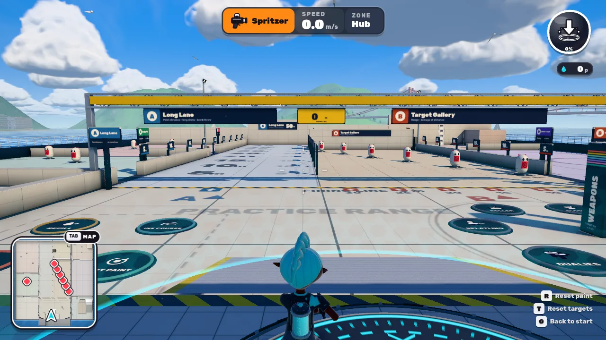

## 1. 基準

| 項目 | 値 |
|---|---|
| 基準 `main` SHA | `5e28dbd16f7829aebd88052ff5f7fdf71f39fdad`（Merge PR #43: integrate INKWAVE local quality fixes） |
| 作業ブランチ | `inkwave/practice-range`（`main` から分岐。他の作業ブランチには依存しない） |
| 比較対象 | 公開版 `inkwave-public/`（`game/` の INKGORGE 試作版は使っていない） |
| 本家参照版 | スプラトゥーン3 Ver.11.3.0（[挙動比較記録](inkwave-splatoon3-behavior-2026-10-02.md)と同じ） |

## 2. ステージ構成（アーキテクチャ）

このリポジトリの方針どおり、上流の `inkwave-public/` はバイト単位で変更していない（`patches/splatoon3/upstream-lock.json` のハッシュ固定も維持）。練習場は `patches/practice-range/` の**ビルド時パッチレイヤー**として実装し、`scripts/build-inkwave.mjs` が既存レイヤーの後に合成する。

```
splatoon3 adaptSource → touch-layout → reliability → local-quality → practice-range（新規）
```

### 接続点（`adapter.mjs`）

各接続はアンカーがちょうど1回現れることを要求する。アンカーが無い・重複する・二重適用された場合はビルドが停止し、未パッチのサイトは公開されない。

| ファイル | 接続内容 |
|---|---|
| `src/world/maps.js` | `MAP_LAYOUTS` に `range` を追加（`MAPS` には追加しない。ステージ選択には出ない） |
| `src/world/stages/index.js` | ステージモジュール登録（props、壁画）に `range` を追加 |
| `src/world/stages/surfaces.js` | texlib の slot 31–33 を練習場専用に追加（Cargo の 28–30 はそのまま） |
| `src/world/levelMaterial.js` | slot 31（床）と 32（壁）だけで動く計測線シェーダー分岐。他ステージはこの分岐に入らない |
| `src/main.js` | `startMatch({mapId:'range'})` の解決、Bot なし、ターフ戦の進行表示を練習場ではスキップ、`installPracticeRange(Game)` |
| `src/ui/hud.js` | 上流の不具合修正：`isJa` の import 漏れ（§13 参照） |
| `index.html` | 練習場の CSS |

### 既存アーキテクチャの再利用

- 地形：既存ステージと同じ `Level` レイアウト（`mapkit` の B/R/O ヘルパー、`single` 配置、ミラーなし）、PropKit の結合メッシュ、texlib 素材、壁画アトラス（ステージ領域 2048×1008）、AO ライトマップ（`layoutHash` 一致時のみ使用）。
- ダミー：本物の `Actor`（チーム1）に専用 `Character`（`TargetDummyCharacter`）を差し込んだもの。被弾・ダメージ・スプラット判定はゲーム本体の `Actor.damage` / `Actor.splat` がそのまま処理する。
- メニュー：既存の Menus ヘルパー（`_btn`、`_panel`、`_header`、`_bind`、`_runWipe` 等）で PLAY 画面の3枚目のカードとポーズ画面を構築。マウス・タッチ・キーボード・パッドの操作体系は既存画面と同じ。
- 時計：練習場のロジックは `Match.update` の中で動くため、ゲームプレイパッチの固定 60 Hz シミュレーション時計に乗る。HUD だけが描画フレームの dt で更新される。

### ファイル構成

| パス | 役割 |
|---|---|
| `range-map.mjs` | マップ定義（`MAPS` / `OFFLINE_MAPS` 外） |
| `install.mjs` | `Match` / `Game` フック。`opts.range` の試合でのみ動作 |
| `stage/zones.mjs` | **全座標の唯一の定義**（ゾーン、看板、ダミー、パッド、ワープ地点）。地形・壁画・看板・セッション・テストがすべてここを読む |
| `stage/layout.mjs` `props.mjs` `surfaces.mjs` `murals.mjs` | 地形、PropKit 配置、素材、床の壁画 |
| `runtime/session.mjs` | ダミー、パッド、リセット、補給、ワープ、テレメトリー |
| `runtime/dummy.mjs` `pads.mjs` `signage.mjs` `hud.mjs` `menu.mjs` `strings.mjs` | ダミー外見、アクションパッド、看板アトラス、HUD、メニュー、日英文言 |
| `styles/range.css` | HUD・モードカード・ポーズ画面 |
| `assets/` | AO ライトマップ、モードカード画像 |
| `tools/bake-ao.mjs` | AO ベイク（本番と同じ `Level` と prop コライダーでレイ判定） |
| `tests/` | ロジック単独テスト 25 件 |

## 3. レイアウト

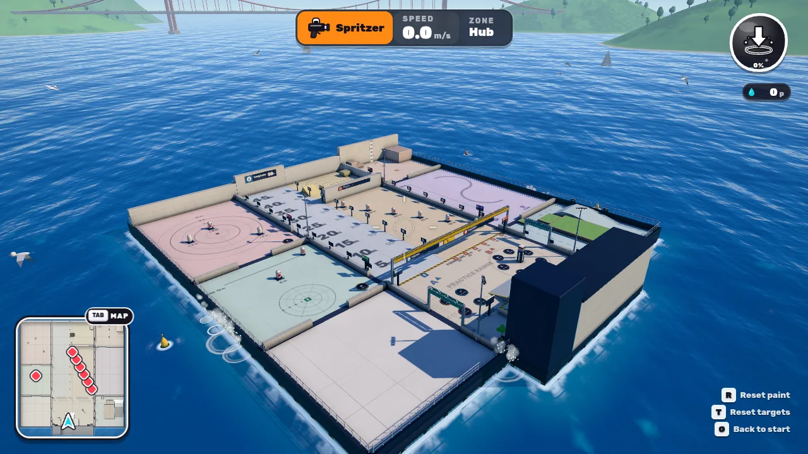
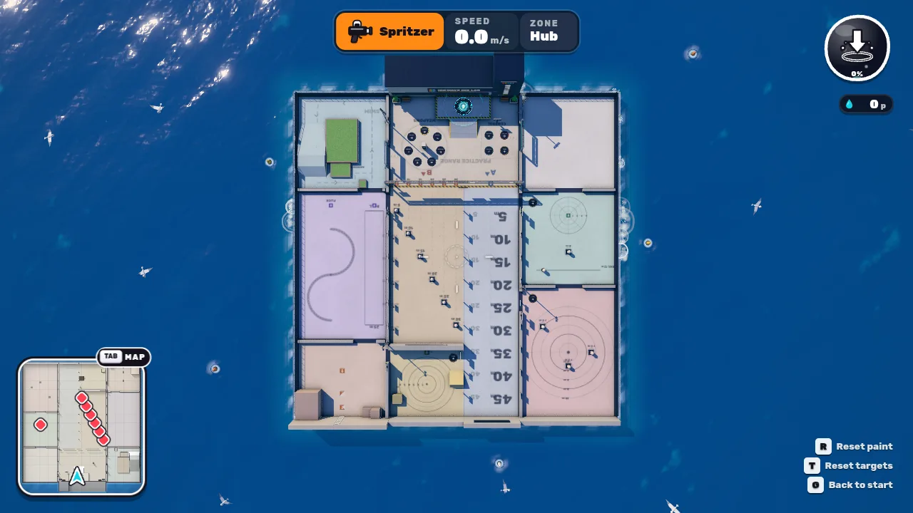

海上の桟橋（枠の外寸 71 × 72 m、ラボ棟を除く）。南端にラボ棟、その前に高さ 1 m のスポーン台。スポーン台から北を向くと、射撃線（z = 0）に掛かる黄色いガントリーの向こうにロングレーンとターゲットギャラリーが一直線に見える。左右の列にほかのゾーンが並び、ハブから全ゾーンへ数歩で行ける。

座標の向き：北が +Z。北を向いたとき **+X がプレイヤーの左**（three.js の右手系でカメラが +Z を向くと −X が画面右）。

```
            x=-37        -17 -16          0            12 13          34
  z=50  ┌──────────────┬───┬─────────────┬────────────┬───┬──────────────┐
        │ G カベラボ    │   │ H ボムピット │            │   │ I スペシャル  │
  z=34  ├──────────────┤   ├─────────────┤ A          │   │   アリーナ    │
        │              │   │             │ ロングレーン│   ├──────────────┤ z=22
        │ D ローラー    │ 枠 │ B ターゲット │ 0〜50 m    │ 枠 │ E スライド    │
        │   コート      │   │   ギャラリー │            │   │   パッド      │
  z=1   ├──────────────┤   ├─────────────┴────────────┤   ├──────────────┤ z=1
  z=0   │ F スイム      │   │ ═══════ 射撃線 z = 0 ═══════│   │ C 塗りテスト  │
        │   コース      │   │  ハブ（ブキ回転台・操作盤） │   │  20 × 20 m    │
  z=-20 │              │   │   [スポーン台] ラボ棟（南）  │   │              │
        └──────────────┴───┴───────────────────────────┴───┴──────────────┘
```

- 枠（幅 1 m のゴム床）が各ゾーンを区切り、その上に仕切り壁を置く。枠と仕切りは塗れない。
- ハブ：ブキ回転台（7種のブキパッド、中央にブキ塔）、操作盤パッド（塗りリセット／ターゲットリセット／コースを塗る／補給）、ゾーン看板。
- ゾーン入口には色帯付きのガントリーとゾーン看板（文字・色・番号）を置き、遠くからでも識別できるようにした。

## 4. ゾーン一覧

| | ゾーン | 範囲（x0, x1, z0, z1） | 内容 |
|---|---|---|---|
| A | ロングレーン | 0 … 12, 0 … 50 | 平坦、50 m。5 m ごとの距離看板（5〜50 m）、1 m グリッド、床の距離数字。基準位置 (6, 0)。北端に高さ 5 m のバックストップ |
| B | ターゲットギャラリー | −16 … 0, 0 … 34 | 5/10/15/20/25/30 m に1体ずつ、列をずらして配置（どの的も手前の的に隠れない）。各列に射撃位置の床印。北端にバックストップ |
| C | 塗りテスト | 13 … 33, −20 … 0 | 白い床、ちょうど 20 × 20 = 400 m²。上に何も置かない。1 m / 5 m グリッド。塗り面積を m² と % で表示 |
| D | ローラーコート | −36 … −17, 1 … 33 | 25 m の直線ストリップ（スタート線 z = 5）、S字カーブ、フリック距離の基準位置 |
| E | スライドパッド（マニューバー） | 13 … 33, 1 … 21 | 基準位置、8 m 先の固定ターゲット、12 m 先を横に往復するレールターゲット、放射線とリング |
| F | スイムコース | −36 … −17, −20 … 0 | 植え込みの島を一周するループ：20 m の直線（5 m ごとの計測ゲート）、緩斜面 9.7°、急斜面 29.7°、広いターン、狭いシケイン。「コースを塗る」で床を自インクにできる |
| G | カベラボ | −36 … −17, 34 … 50 | 高さ 6 m の塗れる壁（0.5 m ごとの線、1 m ごとの太線、高さゲージ）、2/5/10 m の基準位置、高さ 3 m の登りブロック、1 m / 2 m の段差 |
| H | ボムピット | −16 … 0, 35 … 50 | 目標点の周囲に 1〜6 m のリング、7 m 手前の投擲位置、平坦床、壁、角、30° の斜面、跳ね返り用ブロック |
| I | スペシャルアリーナ | 13 … 33, 22 … 50 | 2〜10 m のリング（2 m ごと）、半径 3 / 5 / 8 m に耐久ターゲット（倒れない）、広い平坦床、壁 |

各ゾーンの画面：

| | |
|---|---|
| 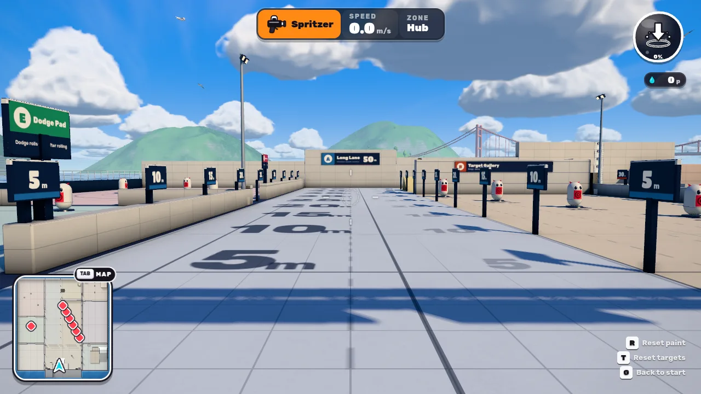 | 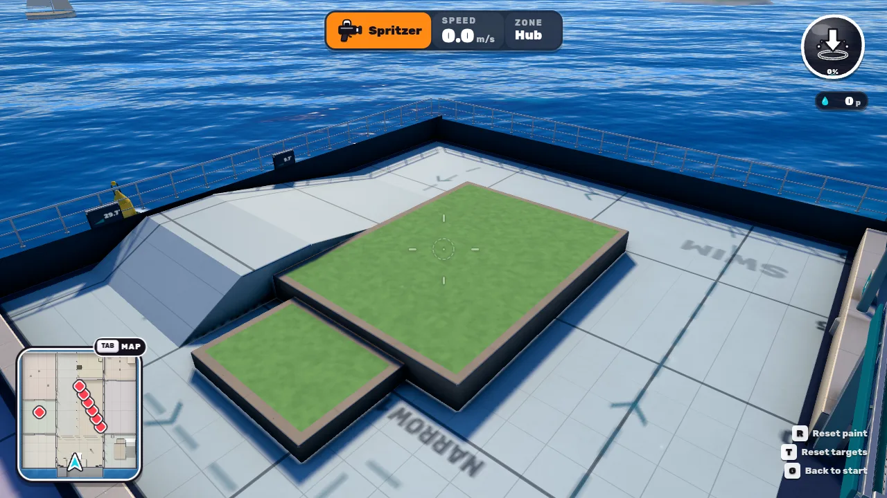 |
| A ロングレーン（射撃線から） | F スイムコース（島・斜面・シケイン） |
| 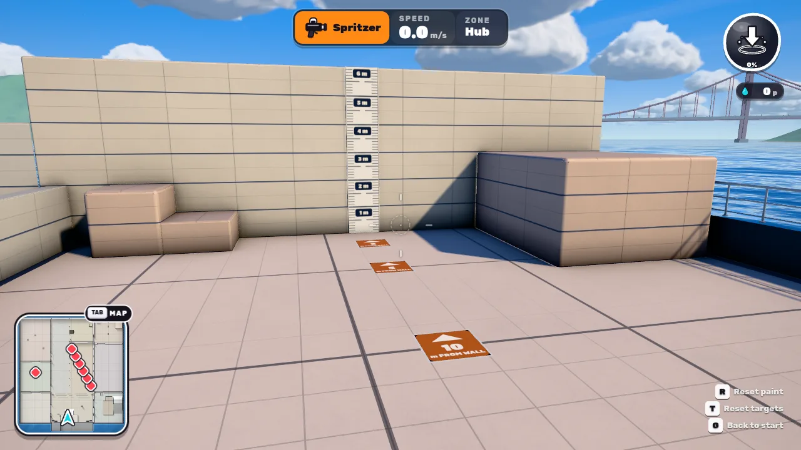 | 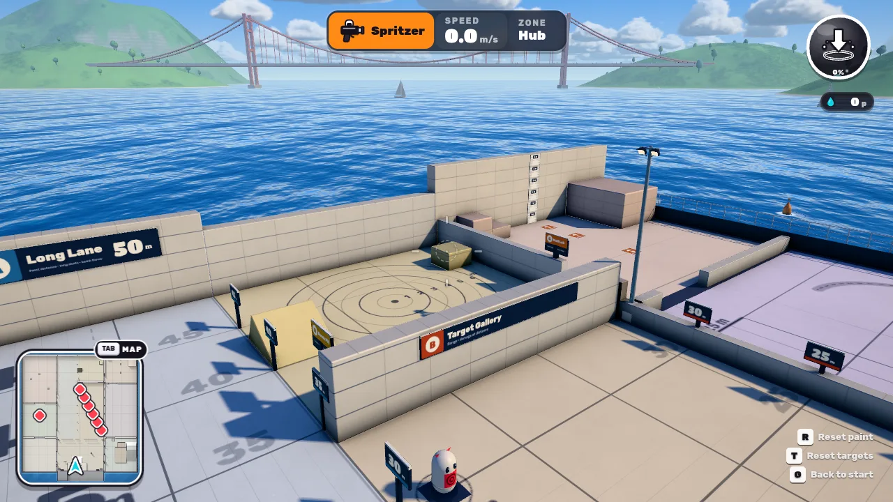 |
| G カベラボ（高さゲージ、10/5/2 m の床印） | H ボムピット、北端の壁 |
| 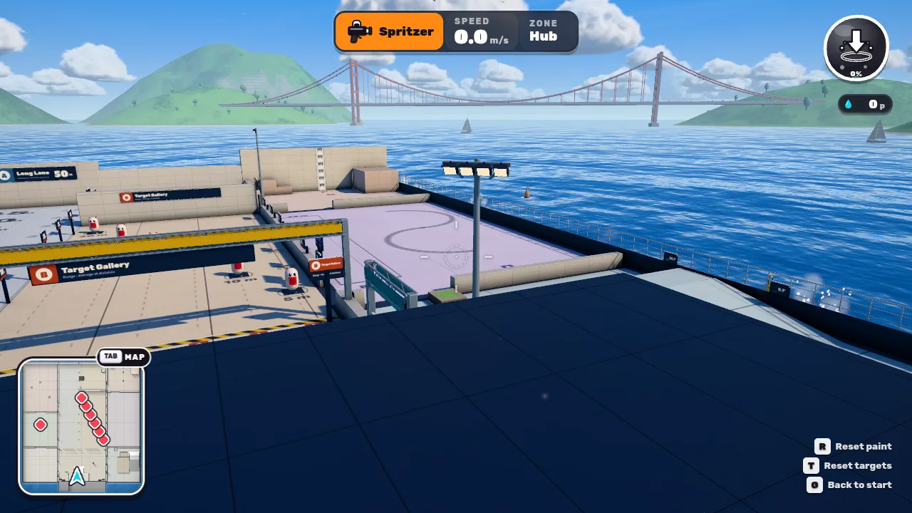 | 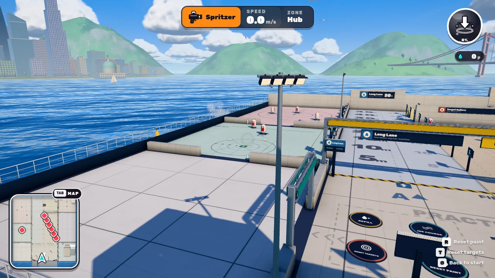 |
| D ローラーコート、F スイムコース | C 塗りテスト、E スライドパッド、I スペシャルアリーナ |

## 5. ワールドスケール

- INKWAVE のワールド単位はメートル。`src/config.js` の `PLAYER` は「meters, seconds」と明記され、全ステージが同じ単位で作られている。
- 練習場の目盛りはすべて**ワールド座標そのもの**：看板の 1 m = 1.000 ワールド単位。
- 現行のパッチ済みプロファイル（`patches/splatoon3/profile.json`）の主な値：歩行 5.76 m/s、泳ぎ 11.52 m/s、シューター射程 12.9 m、マニューバー 12.5 m、スピナー 21 m、チャージャー最大 24.037 m、ブラスター 13.3 m、スロッシャー 14.5 m、ボム投擲初速 67.2 / 重力 57.6、爆風半径 7。
- **INKWAVE のメートルとスプラトゥーン3の内部距離単位の対応は確立していない**（`calibration.distanceScale` は factor 1、status "inferred"）。練習場は INKWAVE を測る設備であり、本家との数値一致を証明するものではない。

## 6. 距離マーカー方式

| 対象 | 基準 | 実装 |
|---|---|---|
| ロングレーン・ギャラリーの距離 | 射撃線 z = 0 からの **ワールド z** | 看板（`zones.mjs` の `SIGNS`）、床の数字（`murals.mjs`）、HUD の「DOWNRANGE」はすべて `z − FIRE_Z` |
| 床グリッド | ワールド x / z の整数メートル（太線は 5 の倍数） | `levelMaterial.js` の slot 31 分岐が**フラグメントのワールド座標**から線を引く。どのスラブ上でも「12 m」の線は z = 12 |
| 壁の高さ | ワールド y（床 = 0） | slot 32 分岐が 0.5 m ごとに線、1 m ごとに太線。ゲージ看板は余白なしで y 0〜6 m に写像 |
| 壁からの距離 | 壁面 z = 50 からの距離 | 2/5/10 m の床印、HUD の「FROM WALL」 = `50 − z` |
| ボム・スペシャルのリング | 目標点 / 中心からの水平距離 | 壁画アトラスにリングを描画。中心座標はテストで照合 |
| 斜面の角度 | `atan2(高さ, 水平長)` | 看板の 9.7° / 29.7° は数式から計算し、テストで実際の地形と照合 |

壁画（床の文字・リング）は、壁画テクスチャ上の 1 px がスラブ上のどの位置に来るかを変換行列で決めており、テスト「floor markings: the mural frame maps world metres to the slab face exactly」で座標の一致を確認している。グリッド線は画素数に関係なく、遠くなると線の平均被覆率へ移行してちらつかない（`rangeLine`）。

## 7. ダミー設計

- 本物の `Actor`（チーム1、ブキなしで撃たない）。ヒットボックスは `PLAYER.radius` / `PLAYER.height` のカプセルで、プレイヤーと同じ。
- ダメージはゲーム本体の `Actor.damage` がそのまま計算する。練習場は `damage` / `splatted` イベントを**読むだけ**。
- 種類：
  - **標準**（ギャラリー 6体、スライドパッド 1体）：通常の HP。倒れると 2.0 秒後にその場で再膨張（練習場だけの規則。プレイヤーの復活時間とは無関係）。
  - **レール**（スライドパッド 1体）：14 m の区間を往復。最高速度は**その時点の `PLAYER.runSpeed`**（現行プロファイルでは 5.76 m/s）。ポーズ画面の「移動ターゲット」で停止できる。
  - **耐久**（スペシャルアリーナ 3体）：HP 1e9。ダメージを表示するが倒れない。スペシャルの範囲確認用。
- 表示：最後のヒットのダメージ、撃った距離、コンボ合計、ヒット数、倒すまでの発数と時間、HP バー。頭上にダメージ数字。1.5 秒ダメージが無ければ新しいコンボ。
- 外見：白いカプセル、正面の的模様はチーム色（ゲームのチーム色に追従）、被弾で傾き・発光。メッシュは2つ（本体、的模様）で、ジオメトリは全ダミーで共有。
- ゲームプレイパッチの被弾・スペシャル・ブキモーションはダミーでは無効（`s3*MotionEnabled = false`）。人型の骨格を持たないため。

## 8. 練習場だけの規則（トレーニング専用ルール）

すべて `match.range`（`opts.range` の試合）にだけ存在する。ほかの試合ではセッション自体が作られない。

| 規則 | 内容 |
|---|---|
| 補給 | 補給パッド（ハブ＋3か所）またはポーズ画面の「補給」で、インク満タン＋スペシャル満タン。**常時無限インクにはしていない**。インク消費・回復はゲーム本体のまま観測できる |
| ブキ変更 | ブキパッドに 0.55 秒乗る、またはポーズ画面。変更時はインク満タン、スペシャル 0（拾い直した状態）。ロードアウトとして保存 |
| 塗りリセット | `G.paint.clear()`、飛翔中の弾の消去、ターフ集計の 0 化 |
| ターゲットリセット | 全ダミーを再膨張、コンボと記録を消去 |
| コースを塗る | スイムコースの床だけを自インクで塗る（島・縁石は除く）。ターフにもスペシャルにも加算しない |
| ワープ | ポーズ画面から各ゾーンの基準位置へ移動（向きも固定） |
| ショートカット | R 塗りリセット、T ターゲットリセット、G スタートへ |
| 試合進行 | タイマーなし、イントロなし、Bot なし、結果画面なし。相手チームのスポーンは到達不能な海中（z = 210, y = −40）に置く（エンジンが2チーム分を要求するため） |

## 9. スクリーンショット・証拠

| ファイル | 内容 |
|---|---|
| `practice-range-evidence/01-spawn.webp` | スポーン時の最初の視点（品質 high、1280×720） |
| `02-overview.webp` `03-top.webp` | 全景、真上 |
| `04`〜`09` | 各ゾーン |
| `11-paint.webp` | 塗りテスト：塗り面積 49.7 m² · 12.4 %（400 m² 中） |
| `13-ja-spawn.webp` `14-ja-pause.webp` | 日本語（既定言語）の HUD とポーズ画面 |
| `15-phone-mode.webp` `16-mode.webp` | PLAY 画面（スマホ 844×390 タッチ、デスクトップ 1280×720） |
| `17-phone-spawn.webp` `18-phone-hit.webp` `19-phone-pause.webp` | ブラウザチェック（スマホ）：スポーン、10 m の的への命中とカード、ポーズ画面 |
| `20-desktop-hit.webp` | ブラウザチェック（デスクトップ）：10 m の的への命中 |
| `21-ja-phone-hit.webp` | スマホ・日本語：的を倒した後のカード（合計 108.0、3 ヒット、たおすまで 3 発） |

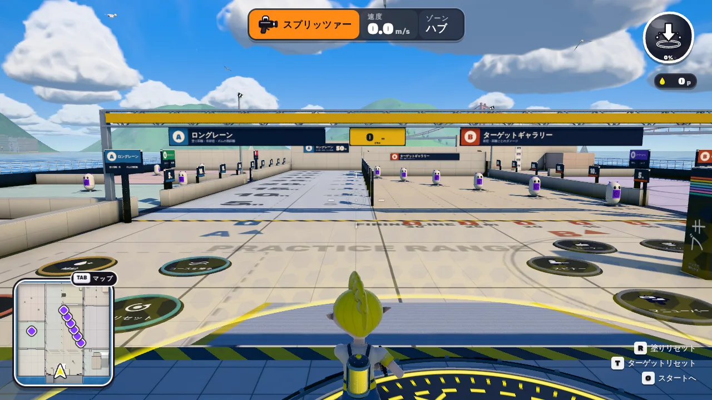
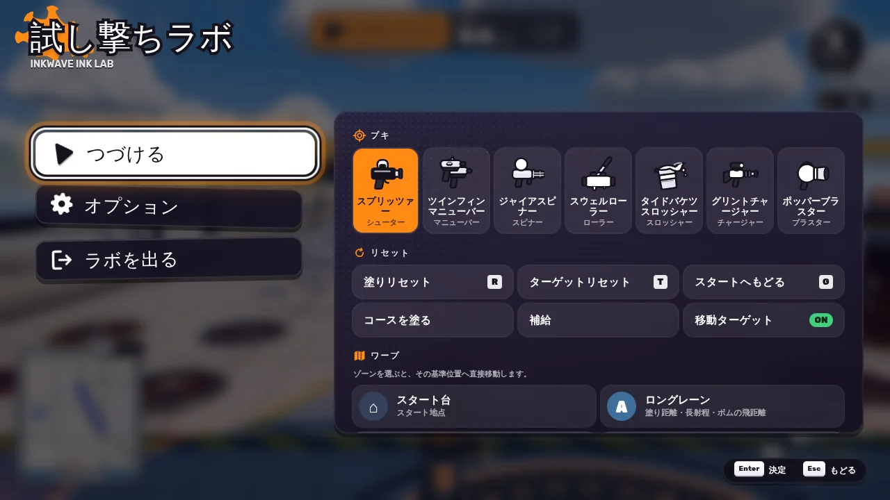
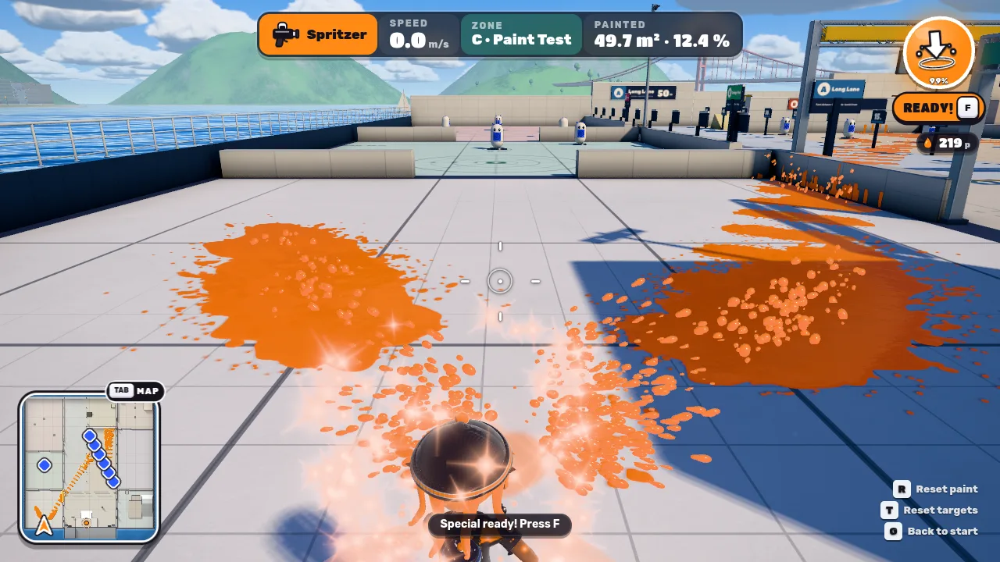

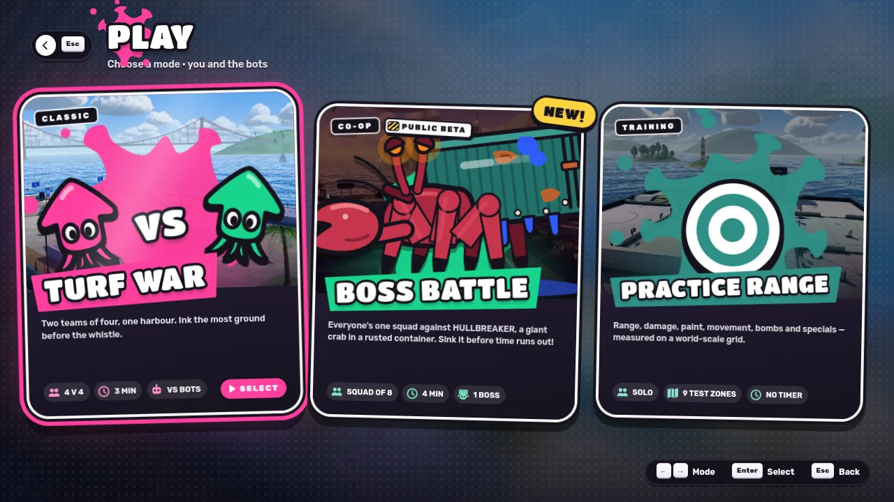

ブラウザ自動チェック（`scripts/check-inkwave-range.mjs`）の結果とスクリーンショットは §12 を参照。

### 視覚レビューで直したもの

1. 段差の縁石が大きな黒い塊に見えた → 植え込み様式に変更。
2. 「▲」がフォント（Rubik）に無く豆腐になった → 三角形を描画。
3. ロングレーンの「m」の位置と距離看板の「m」の欠け → レイアウトを再計算。
4. 看板アトラスのあふれ → 縦長看板用の列パッカーと解像度の調整。
5. 高さゲージの余白が目盛りをずらしていた → ゲージだけ余白なしの厳密写像。
6. PLAY 画面の3枚目のカードが 1280×720 ではみ出した → カード幅の規則を追加。
7. ポーズ画面のパネルがボタンと重なった → 配置を修正。タッチ用の別グリッドを追加。
8. 日本語のポーズ画面でブキ名が中途半端に改行、ワープ一覧が 720p で隠れ、キーボード/パッドのフォーカスがスクロール外に出た → 字間調整、ワープを3列化、フォーカス時に自動スクロール。
9. 射撃線上（z = 0）でゾーン表示が「ハブ」になった → ゾーン判定を半開区間にして、射撃線上はレーン／ギャラリーと表示。
10. PLAY 画面（1280×720）で「PRACTICE RANGE」が2行になり説明文を隠した → デスクトップでは1行に固定。
11. 的が倒れて 2 秒後に再膨張すると、まだ表示中のカードのコンボが「—」に戻った → 終わったコンボ（「SPLAT IN n · t s」）は次のヒットまで残す。
12. ダミーを倒すと対戦用の連続キル表示（「DOUBLE SPLAT!」など）が出て、スマホでターゲットカードの下に重なった → 練習場では非表示（カードが同じ情報を出す）。

## 10. パフォーマンス

Chromium（SwiftShader、1280×720、DPR 1）で `renderer.info` とシーン走査から取得。SwiftShader はソフトウェア描画のため**フレーム時間は測っていない**（実機の GPU 性能の代わりにならない）。

| 品質 high | 練習場（スポーン） | Tidewater（通常の対戦、8人） |
|---|---|---|
| ドローコール（影パス込み） | 67 | 81 |
| 三角形 | 318k | 510k |
| 表示メッシュ | 77 | 190 |
| マテリアル | 59 | 111 |
| テクスチャ | 46 | 55 |
| ライト（影あり） | 2（1） | 2（1） |
| 影を落とすメッシュ | 39 | 85 |
| シェーダープログラム | 138 | 178 |

品質 low のスポーン視点では約 70 ドローコール、約 240k 三角形（Tidewater は 137 / 454k）。

- 静的な小物は PropKit がマテリアルごとに結合（26 配置 → 7 メッシュ、21k 三角形）。
- 看板は全部で **1 メッシュ・1 マテリアル**（2048² アトラス、影なし）。
- アクションパッドは `InstancedMesh`（土台・リム）＋ラベル1メッシュ。
- ダミーは1体2メッシュ、ジオメトリ共有、プログラムは全ダミーで共通。追加ライトなし、パーティクルの常時発生なし。
- ダミーの CPU 負荷（Node、vm realm、60 Hz、11体＋セッション）：1 tick あたり約 0.83 ms（同時に AO ベイクが動作していたので上限寄りの値）。
- 計測線はテクスチャではなくシェーダーの数式なので、追加テクスチャは不要。

## 11. モバイル

- タッチ UI（スマホ 844×390、タブレット 1024×768）では、テレメトリーを縮小、キーヒントを非表示、ターゲットカードを上中央へ移動。ブラウザチェックで**タッチボタンとの重なりが 0 件**であることを確認（`touchOverlap`）。
- ポーズ画面はタッチ用の2列グリッド、狭い画面では1列。
- PLAY 画面は3列（600 px 以下で1列）。
- アクションパッドは乗るだけで作動するので、タッチでもボタン操作は不要。

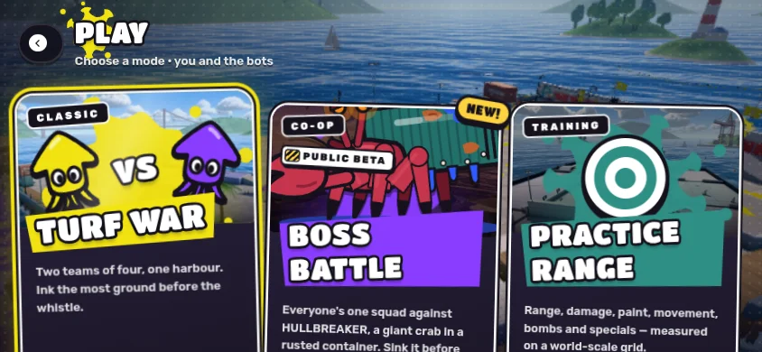
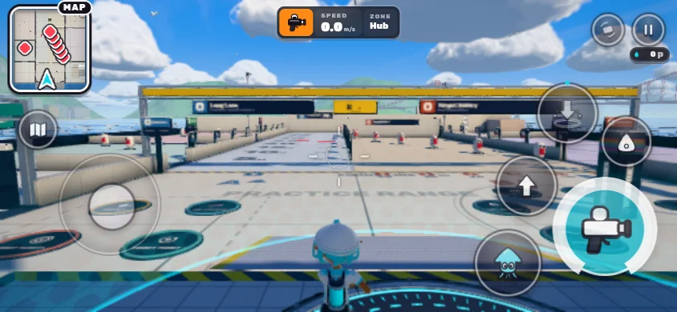
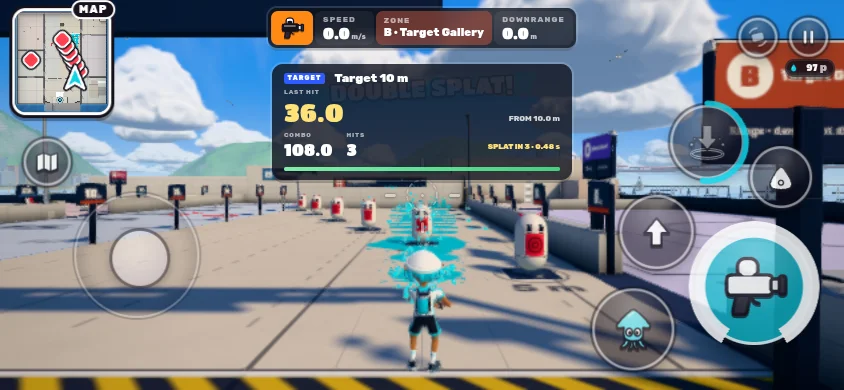
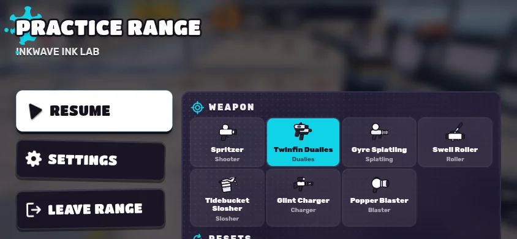
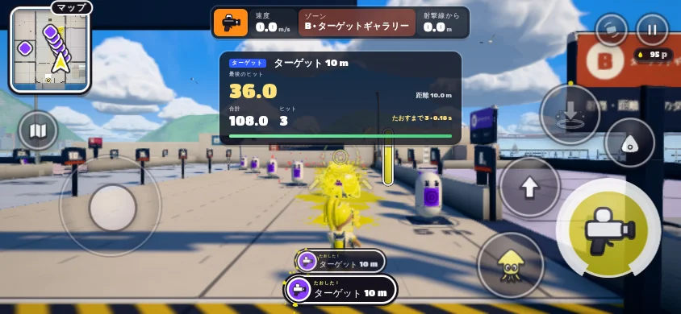

## 12. テスト

### ロジック単独（`node --experimental-vm-modules --test patches/practice-range/tests/*.test.mjs`）

vm realm に本番と同じパッチ合成を行い、本物の `Actor`、`WeaponRunner`、`Projectiles`、`Physics`、`Level` を 60 Hz で回す。描画はしない。**25 件すべて合格**。

| ファイル | 内容 |
|---|---|
| `isolation.test.mjs`（6） | `MAPS` / `OFFLINE_MAPS` に練習場が無い、`main.js` の各分岐が練習場マップ条件付き、通常試合にセッション・ダミーが無くイントロとタイマーがある、slot 31–33 のみ使用、アダプターの一意接続と二重適用の停止、ライトマップのハッシュ一致 |
| `measurement.test.mjs`（6） | ゾーンの重なり無し・範囲内、塗り床がちょうど 400 m² で上に何も無い、ギャラリーの的が看板どおりの距離、壁ゲージと斜面角度、床壁画の座標写像、リングの中心 |
| `session.test.mjs`（6） | ダミーが的台の上で基準位置を向く、`Actor.damage` 経由のダメージ・コンボ・倒すまでの時間・再膨張、耐久ターゲットが倒れない、レールの速度が `PLAYER.runSpeed`、ワープ・補給・ブキ変更・リセット、コース塗りが島を塗らない |
| `zones.test.mjs`（7） | ボムがボムピット内で爆発、5 m の基準位置から壁に塗れる、自インク内で泳ぎ速度に達しコースを進む、ローラーがストリップ上に帯を塗る、マニューバーのスライドが動いてパッド内に留まる、スペシャル（Tidal Slam）が半径内の耐久ターゲットだけに当たる、外周の柵から落ちない |

### ブラウザ（`scripts/check-inkwave-range.mjs`）

ビルド済みサイトを起動し、`?range` で開いて確認する：ステージ・ライトマップ・看板の読み込み、ターゲット 11 体、パッド 14 個、Bot 0、ロスター非表示、10 m の的への命中とカード表示、塗り面積 400 m² の表示、塗りリセットパッド、ブキパッドでの変更、ポーズ画面からボムピットへのワープ、タッチボタンとの重なり。デスクトップ Chromium ではあわせて通常のターフ戦（Tidewater）を開き、練習場の痕跡が無いことを確認する。

| 実行 | 環境 | 結果 |
|---|---|---|
| chromium-desktop | 1280×720 | 合格（10 m の的に 36 ダメージ、距離 10.0 m、カード表示） |
| chromium-phone | 844×390 タッチ | 合格（同上、重なり 0） |
| webkit-tablet | 1024×768 タッチ | **このコンテナでは未実行**（WebKit が無く、`playwright install` は禁止されているため）。CI（`validate-inkwave-update.yml` の UI スイート）で実行される |

### 既存チェック

`scripts/check-inkwave-patches.mjs`、`patches/local-quality/tests`、`scripts/tests` の motion / integration はすべて合格（終了コード 0）。CI（`validate-inkwave-update.yml`、`pages-inkwave.yml`）に練習場のテストとブラウザチェックを追加した。

## 13. 通常の対戦への影響（隔離）

- 練習場は `MAPS` / `OFFLINE_MAPS` に入っていない。ステージ選択、ランダム選択、オンラインの部屋には出ない。入口は PLAY 画面のカードと `?range` だけ。
- `installPracticeRange` のフックはすべて `isRangeMatch(match)`（`!attract && opts.range`）で分岐し、それ以外では元の関数をそのまま呼ぶ。
- 補給・ブキパッド・ダミー・計測線・看板・練習場 HUD は練習場の試合でのみ生成され、試合終了時に破棄される。
- 計測線のシェーダー分岐は slot 31/32 でのみ動く。この slot は練習場以外のステージに存在しない。プログラムキーは `-range1` を付けて区別。
- テスト（isolation 6 件）とブラウザチェック（Tidewater：8 アクター、イントロあり、練習場の痕跡なし）で確認。

### 例外：`hud.js` の上流不具合の修正

上流の `HUD._killCard` は `isJa` を使うが、`hud.js` はそれを import していない。そのため**ローカルプレイヤーが誰かを倒すたびに `splatted` イベント内で ReferenceError が発生**する（全モード）。`emit` は例外を捕まえないので、HUD より後に登録されたリスナー（試合の `_onSplatted` など）が動かず、例外は `Actor.splat` を呼んだ処理（弾の更新ループ）まで伝わる。

練習場ではダミーを倒すことが中心なので、この不具合を避けられない。修正は import 1行の追加だけで、`adapter.mjs` で独立した分岐にしている（他の接続と切り離して取り外せる）。通常の対戦にも効く修正なので、ここに明記する。ブキ・移動・ダメージの数値は変えていない。

## 14. 今後の検証での使い方

1. PLAY → 練習場、または `?range`。ポーズ画面（Esc / メニューボタン）の「ワープ」で各ゾーンの基準位置へ移動する。
2. **射程**：ロングレーン (6, 0) から真っすぐ撃ち、インクの最遠点を床の数字とグリッドで読む。HUD の DOWNRANGE は自分の z。
3. **ダメージ・確定数**：ギャラリーの射撃位置の床印に立ち、的のカードで 1 発のダメージ、距離、倒すまでの発数・時間を読む。
4. **塗り**：塗りテストで撃ち、HUD の塗り面積（m²・%）を読む。R でリセット。
5. **移動**：スイムコースで「コースを塗る」→ 直線のゲート（5 m ごと）で泳ぎ速度、斜面・シケインで旋回。HUD の SPEED は水平速度。
6. **壁**：カベラボの 2/5/10 m 床印から撃ち、壁の線とゲージで塗れた高さを読む。
7. **ボム**：ボムピットの投擲位置から投げ、リングで着弾・爆風位置を読む。
8. **スペシャル**：アリーナ中心で発動し、3/5/8 m の耐久ターゲットのダメージを読む。
9. ブキやパッチの値を変えたら、`tests/zones.test.mjs` 系のロジックテストを追加し、ブラウザで同じ操作を行い、本家実機の録画と比べる。**この3つを互いの代用にしない**。
10. 地形を変えたら `tools/bake-ao.mjs` で AO を再ベイクし、カード画像も必要なら撮り直す（ハッシュ不一致はテストで検出される）。

## 15. スプラトゥーン3との比較（AGENTS.md）

練習場はゲームの挙動を変更していないので、[挙動比較記録](inkwave-splatoon3-behavior-2026-10-02.md)の既存の差分・未確認項目は変化しない（解消済みにした項目は無い）。練習場は今後の比較の**測定設備**であり、比較結果そのものではない。

| 項目 | 本家（Ver.11.3.0） | INKWAVE 練習場 | 確認状態 |
|---|---|---|---|
| 距離の単位 | 本家の試し撃ち場の床ラインの間隔と内部距離単位の対応は、今回公式資料で確認できていない | ワールド座標のメートル、1 m / 5 m グリッド | **未確認**（`distanceScale` は推定値） |
| ダミーの再出現 | 公式の秒数は未取得 | 2.0 秒、その場で再膨張（練習場の規則） | 本家との一致は**未確認**。プレイヤーの復活時間とは独立 |
| ダメージ表示 | 本家の表示形式・項目は今回公式資料で確認していない | 最後のヒット、距離、コンボ、確定数・時間 | 数値はゲーム本体の計算をそのまま表示。本家の数値との比較は**未実施** |
| 動く的 | 本家の動く的の有無・速度は今回公式資料で確認していない | 最高速度 = 現行の歩行速度 5.76 m/s の正弦往復 | **未確認** |
| 歩行・泳ぎ・射撃のフレーム間隔依存 | — | 練習場ロジックは固定 60 Hz の時計で動く。HUD だけ描画 dt | ロジック単独の測定のみ。異なる表示レートでのブラウザ実測は未実施 |

### 練習場で見つかった観察（修正していない・担当外）

- **スプラッシュボムの水平投げ**：ロングレーン (6, 0) で水平（pitch 0）に投げると z ≈ 48.8 m で爆発、やや下向き（pitch −0.3）で ≈ 19.9 m（ロジック単独の測定、`profile.json` の throwSpeed 67.2 / gravity 57.6）。シューター射程 12.9 m の約 3.8 倍になる。本家との比較は単位の対応が未確立のため**未確認**。担当外なので値は変えず、ロングレーンを 50 m にしてこの距離を測れるようにした。
- **`hud.js` の `isJa` import 漏れ**（§13）。

## 16. 未解決・制限事項

- WebKit（タブレット）のブラウザチェックはこのコンテナで未実行。CI で実行される前提。
- iOS / Android 実機、実 GPU でのフレーム時間は未測定（SwiftShader のみ）。
- INKWAVE のメートルと本家の距離単位の対応は未確立。練習場の数値は INKWAVE の値であり、本家の値ではない。
- 練習場は昼のみ（夕方テーマなし）。
- オンライン（ルーム）からは入れない。ソロ専用。
- ダミーはブキを持たず撃ち返さない。被弾時のノックバックなど人型特有のモーションは無効。
- 斜面の角度は2種類（9.7° と 29.7°）とボムピットの 30° のみ。それ以外の角度での歩行・泳ぎは未検証。
- `hud.js` の修正は練習場以外の全モードにも効く（§13）。取り外す場合は練習場のダミーを倒すたびに例外が出る。
- 上記のボム投擲距離の観察は、担当外のため記録のみ。
