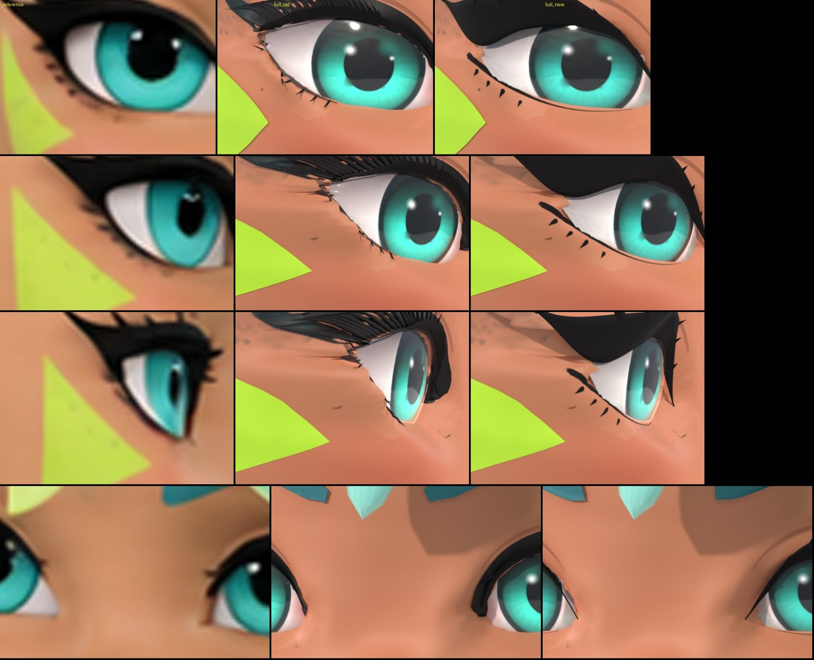
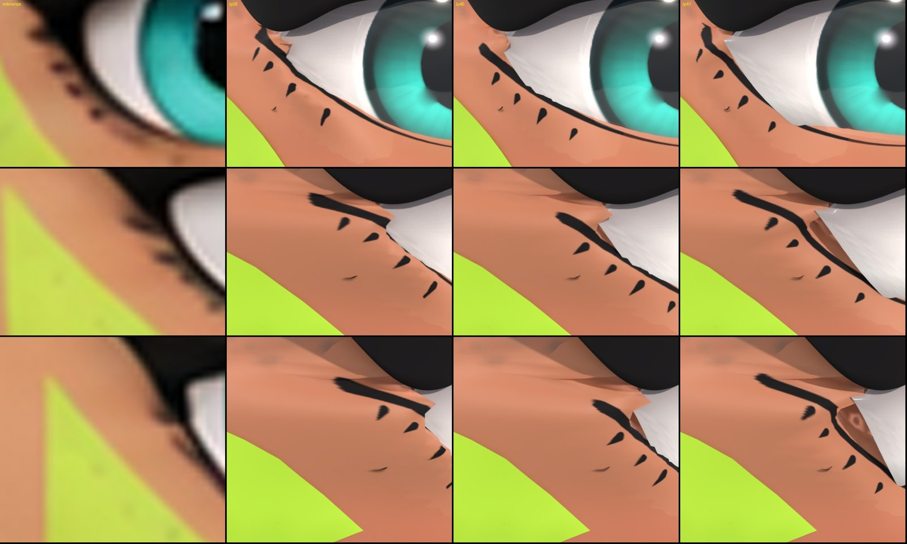

# 目の仕上げ（まつ毛・まゆ・黒目・下まぶたの肌）

`scripts/inkwave_eye_refine.py` で、マスターの目のまわりを参照の絵に近づけました。
マスターにかけた設定は、次のとおりです。

```
blender -b blender/INKWAVE_CHARACTER_MASTER.blend --python scripts/inkwave_eye_refine.py -- \
  --variant lp40 --brow m3 --iris d1 --caruncle cr1 \
  --save blender/INKWAVE_CHARACTER_MASTER.blend \
  --export blender/INKWAVE_CHARACTER_MASTER.glb --game blender/INKWAVE_GAME.glb
```



## 1. 変えたこと

- **上まつ毛**: 細い毛がくしのようにならんだ形をやめました。太いアイラインの帯と、少ない太い毛（4 本と目頭の 3 本）に作りなおしました。帯は、正面、斜め、横の参照の輪郭に合わせた 3D の部品です（`HEAD_eyes_03` / `_20`）。材料はつやのない黒（`INKWAVE_lash_black`）です。
- **下まつ毛**: 下まぶたの線と短い毛を、顔の肌のテクスチャーに描きました（材料 `INKWAVE_face_skin_lash`。顔だけが使う、肌の材料のコピーです）。
- **下まぶたの肌**: まつ毛のある所の肌の凸凹と、白目とのさかい目のギザギザを、なめらかにしました（2 章）。
- **まゆ**（`--brow m3`）、**黒目の色**（`--iris d1`）、**目頭のピンク**（`--caruncle cr1`）も変えました。
- 古いまつ毛の部品 12 個（`HEAD_eyes_04`、`_13`〜`_17`、`_21`、`_30`〜`_34`）は空にしました。そのため、GLB の部品数は 208 から 196 になりました。ゲーム側で、この部品の名前を使う所はありません。

## 2. 下まぶたの肌をなめらかにする方法

Blender の標準の機能だけを使います（`lid_smooth()`）。

1. 顔の上に 0.3 mm 浮いた重ね肌（`HEAD_skin`、`HEAD_skin_04`）に、**Surface Deform** をかけて顔に結びつけます。下まぶたで見えるふちの大部分は、この重ね肌です。重ね肌の一部は、わざと顔の下にかくしてあります。Surface Deform は、上にある点も下にある点も、そのままの関係で顔についていかせます。
2. 顔（`HEAD_face`）に **Smooth** モディファイアー（factor 0.5、20 回）をかけます。かける範囲は一時的な頂点グループで決めます。重みは、下まぶたの線の上で 1 です。線から 10 mm で 0 になります。目じりの近くでは、線より上の上まぶたの肌を動かしません。動かすと、中の暗い面が見えるからです。
3. 重ね肌の Surface Deform を適用します。

この肌の独自の法線は、自動で計算する法線と同じです（差は最大 0.04 度）。なので、形を変えたあとに法線の処理はいりません。



白目とのさかい目のギザギザ（1 ピクセルでならした線からのずれ。参照の絵のピクセル単位）:

| カメラ・目 | 前のマスター 最大 / 平均 | 新しいマスター 最大 / 平均 |
|---|---|---|
| 正面・右 | 0.26 / 0.062 | 0.25 / 0.059 |
| 正面・左 | 0.28 / 0.061 | 0.27 / 0.058 |
| 斜め右・右 | 0.58 / 0.091 | 0.38 / 0.078 |
| 斜め左・右 | 0.36 / 0.078 | 0.27 / 0.069 |
| 斜め左・左 | 0.24 / 0.052 | 0.27 / 0.053 |
| 横右・右 | 1.01 / 0.368 | 0.71 / 0.206 |
| 横左・左 | 0.99 / 0.288 | 0.97 / 0.261 |

## 3. うまくいかなかった方法（くりかえさないこと）

- 独自の計算（Taubin のならし、重ね肌の置きなおし、ふちを眼球にそわせる計算）: 新しい問題が出ました。重ね肌が顔に 4 mm もぐり、肌にギザギザの三角形が出ました。
- **Smooth Laplacian** モディファイアー: このモデルでは、ほとんど動きません（最大 0.05 mm）。
- **Shrinkwrap** で重ね肌を顔にのせる: かくしてあった点が表に出て、ふちが悪くなりました。
- 下まぶたの面を細かく分ける（Subdivide）: そのあと、Surface Deform の結びつけに失敗しました。
- Smooth を 60 回: 目じりに穴のような形が出ました。

## 4. 操作

- 元にもどす: `--restore`。
- もう一度かけても、結果は同じです（元にもどしてから、かけなおすため）。
- 顔の他の手順（`inkwave_face_refine.py`、`inkwave_face_look.py`、`inkwave_face_multiview_fit.py`）をかけなおすときは、先にこのスクリプトの `--restore` をかけてください。

## 5. 検査

| 検査 | 結果 |
|---|---|
| `--restore` の結果と前のマスター（全 224 メッシュ: 位置、独自の法線、UV、材料） | 差 0 |
| 新しいマスターにもう一度かけた結果 | 差 0 |
| 変わったメッシュ | 33（目、まゆ、`HEAD_face`、`HEAD_skin`、`HEAD_skin_04`）。ほかの 191 は同じ |
| 重ね肌が顔から 0.15 mm 未満の点の数（目のまわり） | `HEAD_skin` 89 → 89、`HEAD_skin_04` 101 → 99（ふえていません） |
| 開きなおしの検査（`inkwave_blender_reopen_check.py`） | 合格（208 メッシュ、画像はすべてパック済み、GLB の書き出し成功） |
| GLB の往復検査（`inkwave_roundtrip_qa.mjs`） | 前のマスターと同じく FAIL（髪の既知の差）。ふえた差は、1 章の意図した変更だけです: 空にしたまつ毛の部品、まつ毛と顔の新しい材料、UV のない新しいまつ毛の部品、三角形の数（496,704 → 493,820） |
| `INKWAVE_GAME.glb` | `INKWAVE_CHARACTER_MASTER.glb` とバイト単位で同じ |
| GLB の大きさ | 15.8 MB → 16.5 MB（下まつ毛のテクスチャー） |
