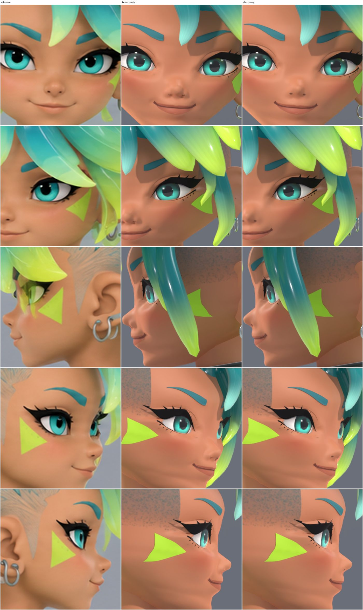
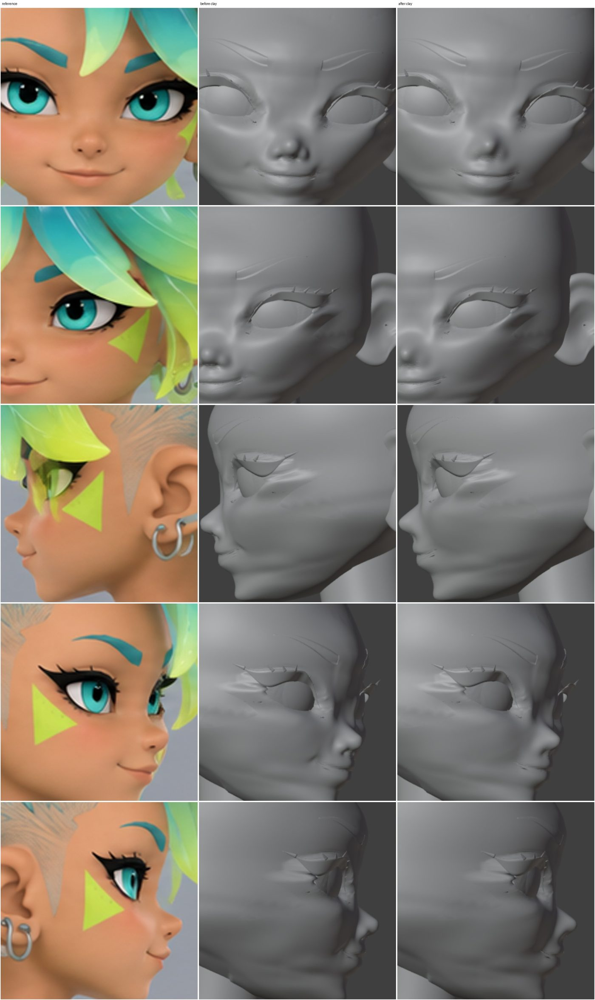
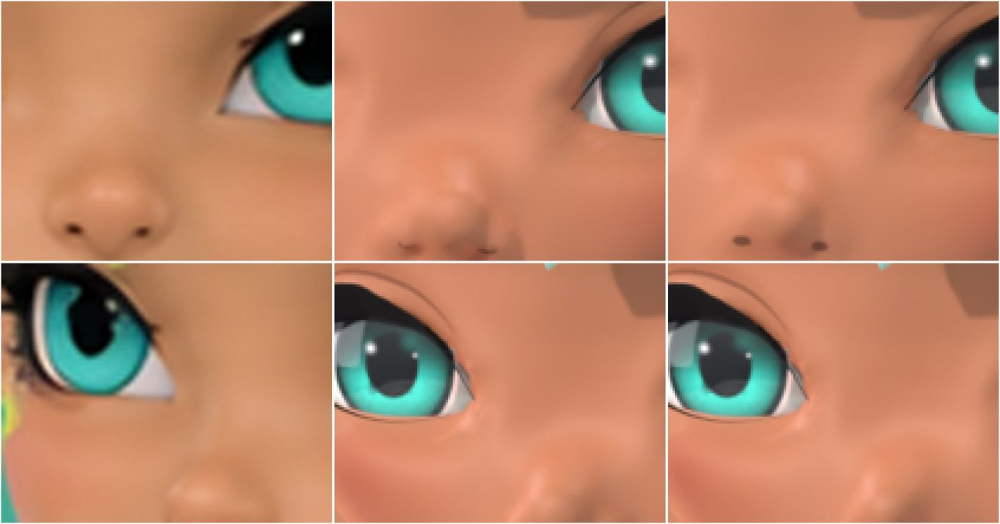

# 顔をやわらかくする（2026-09-29）

目的: 今の顔をこわさずに、参照（`../face-multiview-fit/refs/sheet_5view.png`）の顔に近づける。残っている「強そう・大人っぽい」印象を取る。
前の記録: `PRE-FLIGHT.md`。

## 1. 何が「強そう」に見えていたか（診断）

5 台の固定カメラ（`FACE_FIT_CAM_*`）で、色付き・クレイ・外形を描いて、参照と重ねた。
部位ごとの目印の差（5 ビュー）と、面のシワの強さ（顔の格子のラプラシアンの 95%点）を測った。参照の目印は ±1〜2 px の誤差がある。

| 仮説 | 結果 |
|---|---|
| あごが前に出すぎ・下顎が V 字 | **ちがった**。外形は 5 ビューとも参照の輪郭に合っている。あごを引くと、横の輪郭が参照より内側に入る（下の 2 章）。目印 `menton` の差は、モデル（45° 下向きの端）と参照（手で押した点）の決め方の差 |
| 面のシワ（ほうれい線、口角のくぼみ、小鼻の横の折れ、頬の平らな面） | **主な原因**。クレイで正面と 3/4 にはっきり見える。参照の面にはない |
| 鼻が大きく、立体が強い | **原因の 1 つ**。正面の鼻の穴の幅はむしろせまい（16.6 / 参照 18.8 px）。大きく見えるのは、鼻先の玉と小鼻と鼻の穴のくぼみの強さ |
| 眉が細くとがっている | 眉の形は、正面では参照の輪郭に合っている（`m3` は参照の正面の眉から作る）。目印の「眉が 5〜10 px 高い」は決め方の差（モデルは上のふち） |
| 口の線が硬い・口角のくぼみ | 口角に 0.7 mm のくぼみがあった |

## 2. 候補（すべて別の `.blend`。値は既存のパラメーターだけ）

| 段階 | 候補 | 結果 |
|---|---|---|
| 1 あご・下顎 | `chin_ball_mm` 5.5 → 3.0 / 1.5 / 0、2.0 + 下げ 3.5 mm（4 案） | すべて捨てた。横の輪郭の差が 1.01 → 1.38〜2.34 px に悪化。あごの前の点（`pogonion`）も参照から離れる |
| 1b あごの面 | fit のならしに、あごの前の区間を足す（1 案） | 捨てた。下唇が 5 ビューとも約 1 px 上へずれる。あごのシワは変わらない |
| 2 頬 | fit のならし（Corrective Smooth）に区間を足す: A ほうれい線、**B ほうれい線＋頬の平らな面**、C B＋頬のふくらみ 2.8 mm | **B**。輪郭の差は 5 ビューとも同じ。C は頬と目の下のシワが増えた |
| 3 眉 | 既存の `m1` / `r1` / `r2`（今は `m3`） | **`m3` のまま**。`r1` は 3/4 右と横右で少し合うが、正面で形がくずれる |
| 4 鼻 | N1 鼻の穴のくぼみ −1.5 → −0.7、小鼻 1.3 → 0.6 mm。**N2** N1＋鼻先の丸み 1.8 → 1.2 mm、`nose_volume` 1.8 → 1.2 mm | **N2**。鼻の下の点が正面・3/4・横右で 1.3〜1.4 px 参照に近づく。横左の輪郭 1.01 → 0.93 px |
| 5 口 | **M1** 口角のくぼみ 0。M2 M1＋`mouth_k` 1.3。M3 M2＋上唇の前出し 1.2 mm | **M1**。M2 は口の幅がほとんど広がらず（55.3 → 55.6 px）、口角のシワが増え、上唇が 1.5 px 下がる。M3 は横の上唇が離れる |
| 6 目の開き | しない | 目の幅は参照と 1 px 以内。目は保護の対象 |
| 7 鼻の付け根・額 | しない | 目のまわりを変えないと直らない（`../face-refinement/README.md` 12 章） |

## 3. 入れた変更

- `scripts/inkwave_face_look.py`: `nose` の鼻先 1.8 → 1.2 mm、小鼻 1.3 → 0.6 mm、鼻の穴のくぼみ −1.5 → −0.7 mm。`nose_volume` 1.8 → 1.2 mm。`dimple_mm` −0.7 → 0。
- `scripts/inkwave_face_multiview_fit.py`: 目頭〜頬のならし（Blender の Corrective Smooth）の範囲 `SMOOTH` に `extra` の区間を足した: ほうれい線（小鼻 → 口角）と、目の下の頬の平らな面。目の部品から 1.5〜5 mm は今までどおり動かさない。
- `scripts/inkwave_eye_refine.py`: `--restore --drop-backups`（2 章の順番に必要。`PRE-FLIGHT.md`）。
- マスターの `.blend` と GLB 2 つ。

作り直しの順番:

```bash
cd tools/inkwave-modeler
M=blender/INKWAVE_CHARACTER_MASTER.blend
blender -b $M --python scripts/inkwave_eye_refine.py -- --restore --drop-backups --save $M
blender -b $M --python scripts/inkwave_face_multiview_fit.py -- --restore --save $M
blender -b $M --python scripts/inkwave_face_look.py -- --save $M
blender -b $M --python scripts/inkwave_face_multiview_fit.py -- --field analysis/multiview/field.json --save $M
blender -b $M --python scripts/inkwave_eye_refine.py -- --variant lp40 --brow m3 --iris d1 --caruncle cr1 --save $M \
  --export blender/INKWAVE_CHARACTER_MASTER.glb --game blender/INKWAVE_GAME.glb
```

## 4. 結果







| ビュー | 輪郭の差 RMS px（前 → 後） | 顔の目印の差 RMS px（目・眉・耳を除く） |
|---|---|---|
| 正面 | 1.13 → 1.13 | 3.66 → 3.24 |
| 3/4 左 | 1.23 → 1.24 | 6.44 → 6.37 |
| 横 左 | 1.01 → 0.93 | 4.34 → 4.46 |
| 3/4 右 | 1.15 → 1.16 | 4.78 → 4.66 |
| 横 右 | 2.42 → 2.44 | 6.86 → 6.85 |

面のシワ（95%点、mm、小さいほどなめらか）: ほうれい線 0.73 → 0.45、口角 0.66 → 0.50、鼻 1.54 → 1.20、目の下 0.58 → 0.55、下顎 0.38 → 0.35、頬 0.43 → 0.41。あご 1.34 と唇 0.97 はほぼ同じ。

鼻の穴の貼り物（`HEAD_skin_03` / `_06`）は、前は 49 / 73 頂点が肌の下にもぐり、細い線の一部だけが見えていた。後は 0 で、参照と同じ小さな 2 つの点になった。

## 5. 検査

| 検査 | 結果 |
|---|---|
| 変わったメッシュ | `HEAD_face`（最大 1.71 mm）、`HEAD_skin*` の貼り物 7 つ（最大 1.43 mm）と、その fit 前のコピー。ほかの 208 は完全に同じ |
| 目・眉（`HEAD_eyes*`、`HEAD_brows*`） | 位置・頂点数・UV・材料・画像がすべて同じ。下まつ毛の塗り（`INKWAVE_face_lash_paint`）は顔の形に合わせて描き直され、1,680 万画素のうち 3,290 画素が変わった（黒の面積 13,140 → 13,135） |
| 頂点数・UV | すべてのメッシュで同じ |
| 本番のスクリプトだけでの作り直し | 候補と 224 メッシュすべてが同じ |
| もう一度かけた結果 | 差 0（224 メッシュ） |
| 開き直しの検査（`inkwave_blender_reopen_check.py`） | 合格（208 メッシュ、486,596 三角形、パックされていない画像 0） |
| GLB の往復検査（`inkwave_roundtrip_qa.mjs`、前回と同じ条件） | 前のマスターと問題の一覧が同じ（髪と、前回の目の作業の既知の差）。増えた問題 0、消えた問題 0 |
| `INKWAVE_GAME.glb` | `INKWAVE_CHARACTER_MASTER.glb` とバイト単位で同じ |

## 6. 残り

- 口の幅: 正面で参照より約 5 px せまい（55.3 / 60.5 px）。口の線の貼り物の長さの差で、形の変更（`mouth_k`）では広がらない。
- あごのシワの数字（1.34）は変わらない。あごの下のふちの曲がりで、外形は参照に合っている。
- 目の開き（参照は縦にも丸い）は、目の保護のため触っていない。
